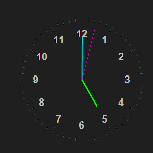

# 3D Rotating Clock

A beautiful, customizable analog clock built with AutoHotkey v2.0.

## Features

- 3D-style analog clock face with smooth animations
- Transparent, always-on-top window
- Draggable interface
- Resizable using mouse wheel (50px to 200px radius)
- Multiple color themes:
  - Classic (Blue/Green/Red)
  - Night (Green/Yellow/Purple)
  - Neon (Magenta/Cyan/Green)
  - Monochrome (White/Gray)
  - Ocean (Blue tones)
  - Sunset (Purple/Orange/Pink)
  - Forest (Green tones)
  - Autumn (Brown tones)
  - Arctic (Light blue tones)
  - Volcano (Red/Orange tones)

## Requirements

- Windows operating system
- [AutoHotkey v2.0](https://www.autohotkey.com/)

## Installation

1. Install AutoHotkey v2.0
2. Download `3DRotatingClock.exe` from [Releases](https://github.com/royal-crisis/3d-rotating-clock/releases)
3. Double-click to run the clock

## Usage

- **Move the clock**: Click and drag anywhere on the clock
- **Resize the clock**: Use mouse wheel up/down while hovering over the clock
- **Change themes**: Right-click the tray icon and select Themes
- **Exit**: Right-click the tray icon and select Exit

## Technical Details

- Uses GDI+ for smooth graphics rendering
- 60 FPS animation (16ms timer)
- Transparent window with click-through capability
- Precise millisecond-level hand movements
- Dynamic scaling of clock elements based on size
